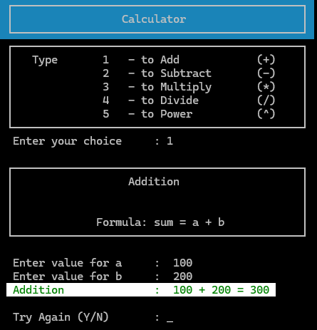
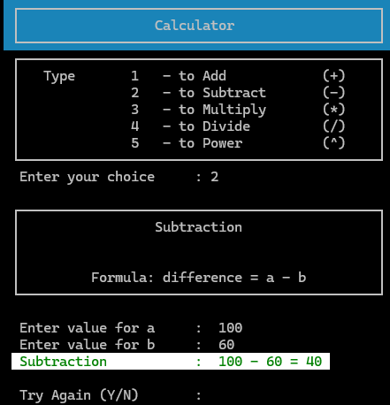
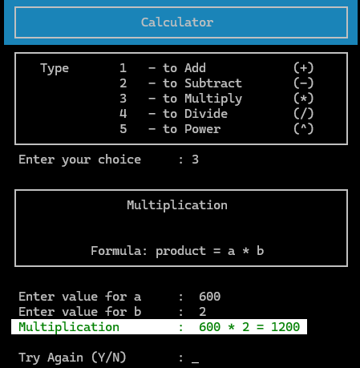
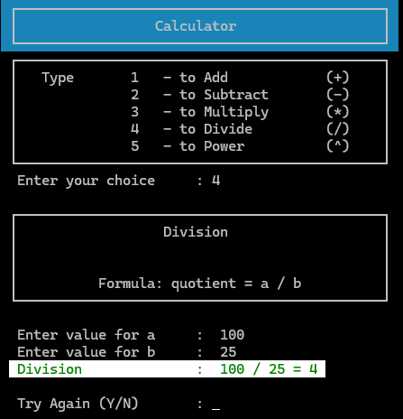
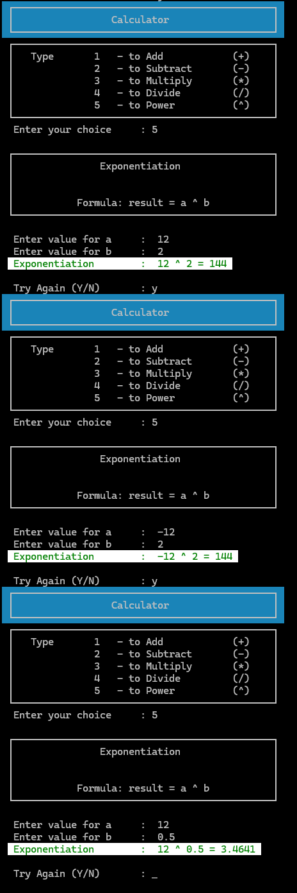
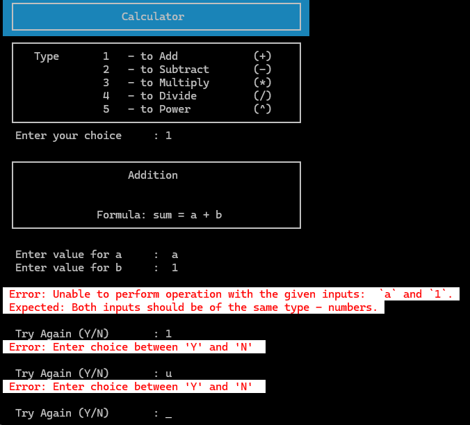
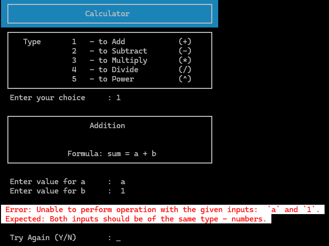

_This README.md file was created with assistance from AI - GitHub Copilot. The remaining code was developed without AI support, except where explicitly indicated in the code comments._
# Calculator (Console) C#

Purpose
- Small console calculator demonstrating basic operations (add, subtract, multiply, divide, power).

Prerequisites
- .NET 10 SDK installed (dotnet CLI available).

How the project is organised
- `Calculator/` � application project (console app).
  - `Program.cs` � entry point. Also exposes `Program.Run(TextReader, TextWriter)` for test-friendly in-process execution.
  - `Utility.cs`, `Calculate.cs`, `AnsiColorCodes.cs` � helpers and operation logic.

# Build and run (CLI)
1. Build:
   - dotnet build Calculator
2. Run the app:
   - dotnet run --project Calculator

# Screenshots

The Menu

Addition

Subtraction

Multiplication 

Division 

Exponentiation 

Division by zero

Error - Try Again - invalid choice, re prompt

Error - Invalid Operands

Error - Menu choice error and max attempt

## Contact

If you have questions or need further changes, reply here or refer to the course materials.
